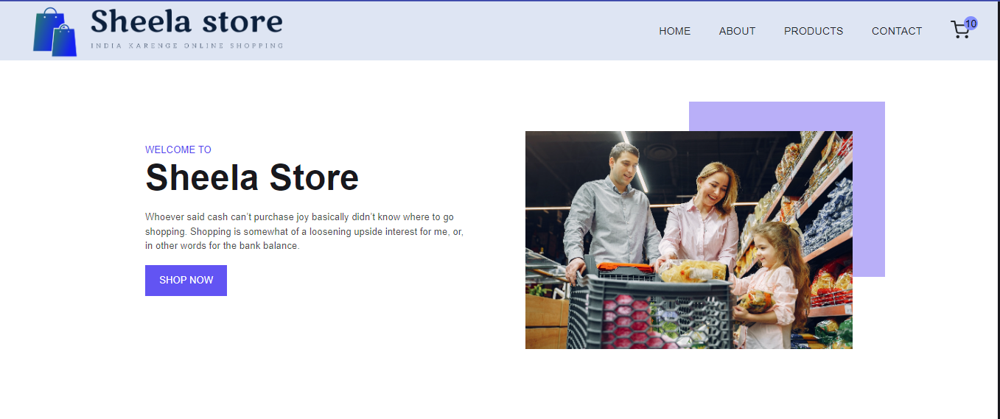
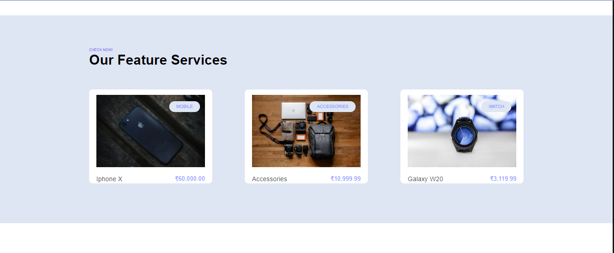
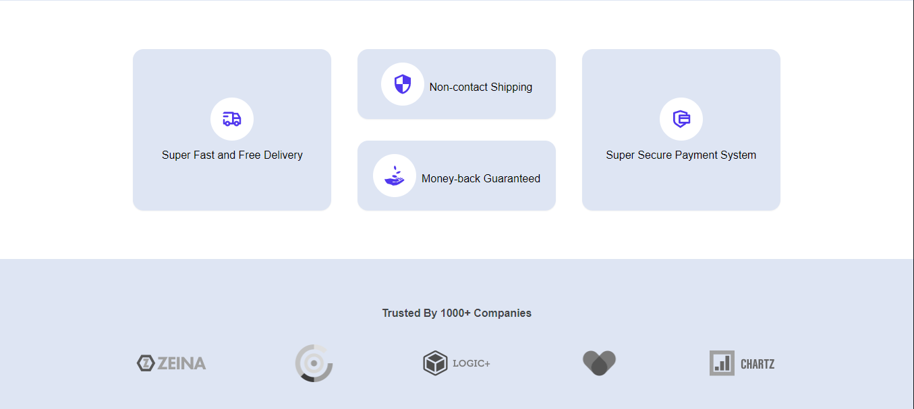
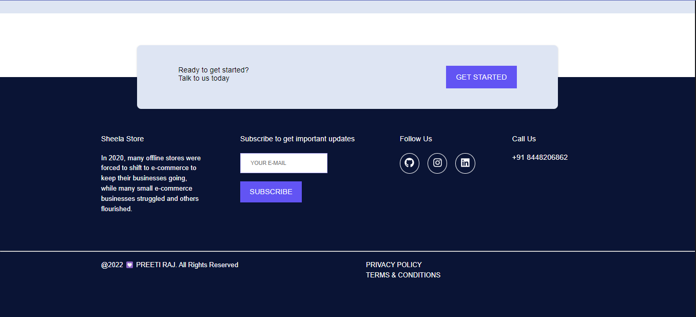

## Welcome to Sheela Store { This store insprition is my mom} Ecommerce Website
[](https://github.com/cobidev/gatsby-simplefolio/blob/master/LICENSE.md) 
 


### Features:

---

##### Here's features included in this project

- Add to cart functionality
- Shopping cart functionality
- Product Filtering functionality
- Product page with all sorting and searching
- Singal Product page With Additional images change functionality
- Cart and checkout page
- Contact page
- Login and Register page
- Awesome modern minimalist UI
- Go To Top on Page Functionality

### Technologies Used:

---

1. React.js
2. React Router
3. Redux

For Styling 

1. Styled Components

For login and Registration

1. Auth0
### Links

---

1. Netlify https://sheelastore.netlify.app
2. vercel  https://sheela-ecommerce-website.vercel.app


### How to start?

---

##### To start the project along with me just download the start-up file and run available script

```javascript
// first install all necessary dependencies

npm i

// next run

npm start

```
#### Project Look Like 

  
  
  
  <hr/>

https://user-images.githubusercontent.com/107460745/202193167-1753d63f-8469-4e83-8bbb-a389537f605a.mp4

